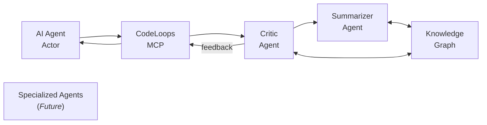

# CodeLoops: Enabling Coding Agent Autonomy

CodeLoops is currently an experimental system, taking a different approach to help bring us closer to the holy grail of software development: fully autonomous coding agents.

Inspired by the actor-critic model from Max Bennett’s _A Brief History of Intelligence_, CodeLoops aims to tackle the challenge of AI Agent “code slop”: messy, error-prone output that forgets APIs and drifts from project goals. By integrating with your existing agent as an MCP server, it delivers iterative feedback and persistent context, empowering your agent to work independently in auto mode while staying aligned with your vision.

> **Note**: CodeLoops is in early development. Expect active updates. Back up your data and monitor API costs for premium models.

Learn more by:

- [reading the announcement](https://bytes.silvabyte.com/improving-coding-agents-an-early-look-at-codeloops-for-building-more-reliable-software/).
- [checking out the overview](./docs/OVERVIEW.md).

## Why CodeLoops?

AI coding agents promise to revolutionize development but suck at autonomy in complex projects. They suffer from memory gaps, context lapses, and a lack of guidance, producing unreliable code that requires constant manual fixes. CodeLoops unlocks their potential by providing:

- **Iterative Feedback**: An actor-critic system refines your agent’s decisions in real time, guiding it toward precise, high-quality output.
- **Knowledge Graph**: Stores context and feedback, ensuring your agent remembers APIs and project goals across sessions.
- **Seamless Integration**: Enhances the tools you already use like Cursor or Windsurf, letting your agent work smarter without disrupting your workflow.

For developers building larger scale software or non-developers bringing ideas to life, CodeLoops could transform your agent into a reliable autonomous partner.

## Quick Setup

Get CodeLoops up and running in minutes:

```bash
# Clone the repository
git clone https://github.com/matsilva/codeloops.git
cd codeloops

# Install dependencies with Bun
bun install

# Configure your API keys (optional setup script)
bun run setup
```

The setup script helps with:

- Verifying prerequisites (Node.js).
- Configuring API keys for models like Anthropic or OpenAI.

Alternatively, you can manually configure your API keys in the `codeloops.config.json` file or via environment variables.

> **Tip**: I’ve had great results with Anthropic’s Haiku 3.5, costing about $0.60 weekly. It’s a solid starting point.

If this script fails, see [install guide](./docs/INSTALL_GUIDE.md) for installing the project dependencies

### Configure Your Agent

Connect your agent to the CodeLoops server by adding the MCP server configuration. CodeLoops supports both stdio and HTTP transports:

#### Option 1: Stdio Transport (Default)

```json
"mcp": {
  "servers": {
    "codeloops": {
      "type": "stdio",
      "command": "bun",
      "args": ["run", "/path/to/codeloops/packages/server/src/index.ts"]
    }
  }
}
```

#### Option 2: HTTP Transport

```json
"mcp": {
  "servers": {
    "codeloops": {
      "type": "http",
      "url": "http://localhost:3000"
    }
  }
}
```

For HTTP transport, start the server first:

```bash
bun run start:http
# or with custom port/host
bun run packages/server/src/index.ts --http --port 8080 --host 127.0.0.1
```

Refer to your platform's documentation for specific MCP configuration instructions.

## CLI Options

CodeLoops supports the following command-line options:

- `--stdio`: Use stdio transport (default)
- `--http`: Use HTTP transport
- `--port <number>`: HTTP server port (default: 3000)
- `--host <string>`: HTTP server host (default: 0.0.0.0)
- `--help`: Show help message

**Examples:**

```bash
# Start with stdio (default)
bun start

# Start HTTP server on default port 3000
bun run start:http

# Start HTTP server on custom port
bun run packages/server/src/index.ts --http --port 8080

# Start HTTP server on specific host and port
bun run packages/server/src/index.ts --http --host 127.0.0.1 --port 9000
```

## Using CodeLoops

With the server connected, instruct your agent to use CodeLoops for autonomous planning and coding.

### Example Prompt

```
Use codeloops to plan and implement the following:
... (insert your product requirements here)
```

## Available Tools

CodeLoops provides tools to enable autonomous agent operation:

- `actor_think`: Drives interaction with the actor-critic system, automatically triggering critic reviews when needed.
- `resume`: Retrieves recent branch context for continuity.
- `export`: Exports the current graph for agent review.
- `summarize`: Generates a summary of branch progress.
- `list_projects`: Displays all projects for navigation.

## Basic Workflow

1. **Plan**: Add planning nodes with `actor_think`, guided by the critic.
2. **Implement**: Use `actor_think` for coding steps, refined in real time.
3. **Review**: The critic autonomously evaluates and corrects.
4. **Summarize**: Use `summarize` to generate clear summaries.
5. **Provide Feedback**: Offer human-in-the-loop input as needed to refine outcomes. YMMV depenting on how smart the coding agent is.

CodeLoops leverages an actor-critic model with a knowledge graph, where the Critic can delegate to a chain of specialized agents for enhanced precision



This architecture enables your coding agent to maintain context, refine decisions through specialized checks, and operate autonomously with greater reliability.

### Need Help?

- Check [GitHub issues](https://github.com/silvabyte/codeloops/issues).
- Discord: [Join CodeLoops Discord](https://discord.gg/vZCWmr6X)
- File a new issue with details.
- **Email Me**: [mat@silvabyte.com](mailto:mat@silvabyte.com).
- **X**: [Reach out on X](https://x.com/MatSilva).

### License & contributing

This project is entirely experimental. Use at your own risk. & do what you want with it.

MIT see [license](../LICENSE)
